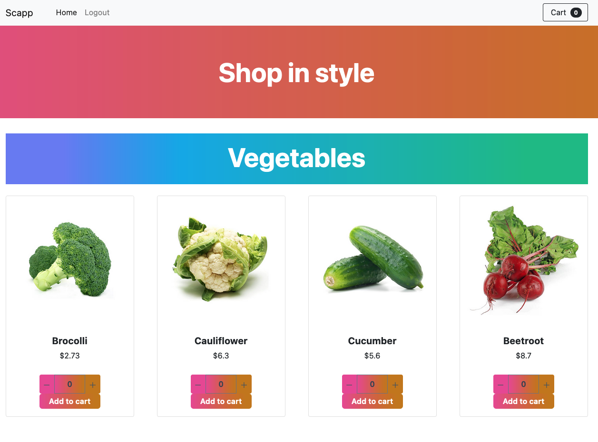

# :books: LINFO2145 Project: Front-end

**LINFO2145 Autumn, 2023** -- *Etienne Rivière, Donatien Schmitz, Yinan Cao, and Samy Bettaieb*


## Objectives

This tutorial shows you how to:

1. Build and deploy the front-end with Docker.
1. Use the front-end Web interface;
1. Understand the structure of the source code;

:bulb: **Recall.**
We encourage you to follow the tutorial solo.

:bulb: **Recall.**
This tutorial requires you to complete some exercises that are tagged with this icon :pencil2:

## Introduction

The structure of the application is kept simple (see image below).
The main page is a catalog of products grouped by categories.



We detail below how to build and deploy a container with the front-end of the application (*served and running in the client web browser*).
You will need to create and use your container image for development and testing.

## Build and deploy

`npm` is a package manager for Javascript.
Some of the tasks you may perform with `npm` are: installation of dependencies, creation of releases or unit testing.
Svelte applications are maintained with `npm`.
The tool is already included in the `nodejs` base Docker image.

We can now build our first version of the frontend!
The image shall contain the source code itself, and all dependencies, libraries, etc. it needs.

:pencil: **Note.**
The list of dependencies is in the JSON file `package.json`.

The following Dockerfile lets you build an image of the front-end.

``` dockerfile
FROM node:20-alpine AS build

WORKDIR /app

COPY package.json ./

RUN npm install
COPY . ./
RUN npm run build

CMD node build
```

:pencil: **Exercises.**
To create a container with this version of your front-end, complete these tasks:

1. Create a `Dockerfile` with the previous content in the directory `../src/front-end`;
2. Build an image of your new front-end with the name `scapp-frontend` 
3. Run a container of this image with port __3000__ forwarded (default port of this application);

4. In a new tab of your web browser, show the main page of the front-end (the address is the ip of your VM + the port your indicated in the `docker run` command);

:bulb: **Recall.**
Whenever you alter the source code, you have to re-build the Docker image.


## Purchases in SCApp

Users without an account are **only** able to *consult* the catalog of products while registered users may also *purchase* products.
To create an account, click on the **Register** button and provide a username and a password.

The **ADD TO CART** button under every product picture is now enabled.
Users may start the checkout procedure by clicking on the top-right button and then on the **CHECKOUT** button.
Another page appears with the history of purchases.

The front-end mimics an authentication service by locally storing users' information.
Note that users authentication information and purchases are not persistent.
If you clear your local storage, you will need to re-register in order to log again.

## Source code

Since you will make minor changes to the front-end in the first part of the project, this section provides a brief overview of the code organization.

The front-end is a [Svelte](https://svelte.dev/) application.
Its source code is in the folder `../src/front-end`.
Below, you will find a brief description of its content.

``` text
front-end
├── package.json            << dependencies and instructions to build/deploy
├── src/
│   ├── assets/css/          << style assets 
│   ├── interfaces/         << components (cart, product, ...)
│   ├── routes/             << routes - each folder represents a single route
│   ├── stores/             << helpers for storing shared object
│   └── app.html            << main page
└──static/
    └── favicon.png
```

The front-end is formed of several Javascript classes.
The code of these classes follows the Svelte syntax, a combination of Javascript and XML-like tags (more details in [this link](https://learn.svelte.dev/tutorial/welcome-to-svelte)).
Before continuing, we **strongly** suggest you follow in detail this small and interactive tutorial, more precisely the following sections:
1. Introduction
2. Reactivity
3. Props
4. Logic
5. Bindings
6. Stores

## Final comments

:checkered_flag: **That's it.**
You have now an overview of the front-end.
Continue with the authentication micro-service tutorial ([link here](02_ProjectSetup_AuthenticationService.md)).
